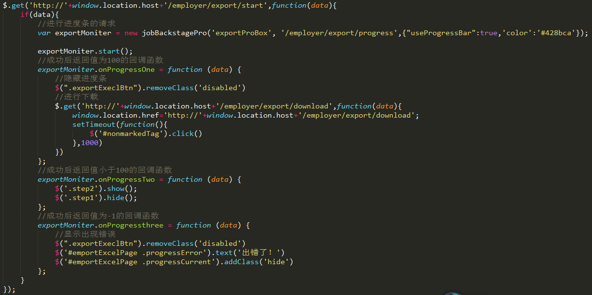

## 就业管理系统进度条js组件
这是针对于就业管理系统的一个js组件，根据后台所传的值可以实现进度条效果
### 特性 feature
- 实现进度条效果（依赖后台返回的数据结构）
- 根据后台的返回值，不断地进行请求
- 发生错误继续重新请求
### 依赖 dependence
- jquery
### 数据结构
返回的数据是json格式（共有三种状态）
- progress为100（任务完成）
- progress小于100（任务未完成）
- progress为-1（任务执行出现错误）
### 用法
- 依赖于jquery
- objId（上传页面的父级id）
- url（请求进程的路径）
- options（配置的参数）
#### opations配置项
- useProgressBar:false，// 是否使用进度条，默认：false
- delayGaps : 500， // 进程请求间隔递增毫秒数，默认：0毫秒（建议不要超过1000，否则进度条反应慢，影响用户体验，）
- timeout : 5000， // 一次请求超时的时间限制
- retryCount :0,  //发生错误时重试的次数
- retryLimit :10; // 当发生错误时请求的最大次数，默认：10次
- retryGaps :1000, // 发生错误时，重新发送请求的时间间隔，默认：1000毫秒
- color:'#0000ff'//默认进度条颜色（蓝色）
### 实例方法methods
> onError：function(xhr,retryCount){}出现错误时的回调函数（xhr为ajax的对象，retryCount为当前请求重试的次数）

> onProgressOne ： function (data) {}成功后返回值为100的回调函数

> onProgressTwo ： function (data) {}成功后返回值小于100的回调函数

> onProgressthree = function (data) {}成功后返回值为-1的回调函数(展示错误原因)

### 实例（以用人单位数据库的导出为例）

